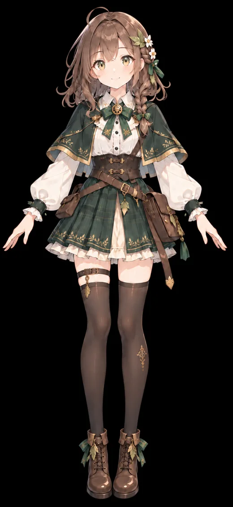
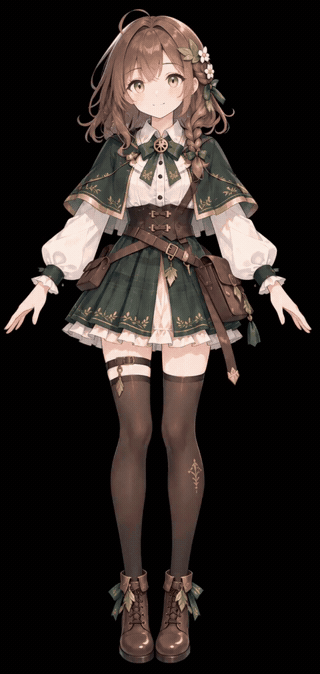
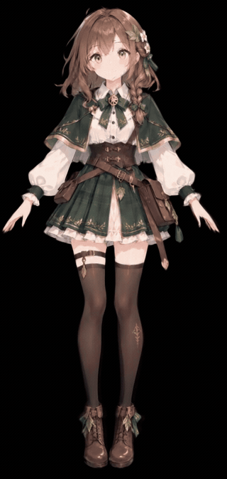
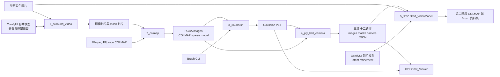
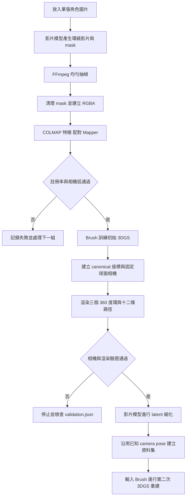
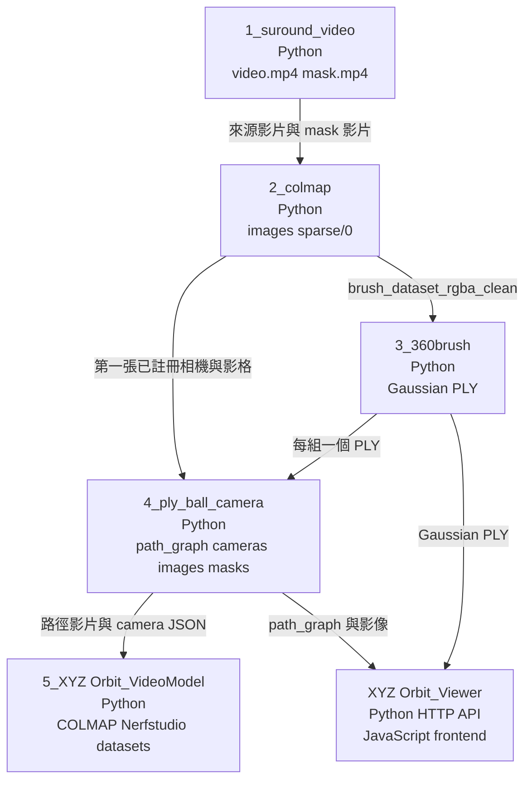

# VideoSplat

## 專案總覽（Project Overview）

VideoSplat 是一組以 Python 為主的研究工具鏈。系統從單張角色圖片出發，使用影片模型產生角色環繞影片，再經過遮罩清理、COLMAP 相機姿態估計與 Brush 訓練建立 3D Gaussian Splatting（3DGS）角色。初始模型完成後，系統會建立固定的三維相機軌跡，渲染水平、垂直與斜向環繞視角，供第二階段影像細化與 3DGS 重建使用。

本專案解決的問題，是把生成式影片提供的跨視角影格轉成可驗證、可重建且具有可追溯相機姿態的三維資料。使用對象是研究單張影像三維化、多視角生成、3DGS 重建、Gaussian-to-Mesh 與角色動畫流程的工程師或研究者。專案性質是由五個 Python 處理步驟、ComfyUI 工作流及一個本機 Viewer 組成的研究工具。

以下展示直接取自原始專案的角色 2。GIF 可在 GitHub README 內直接播放；下方亦保留完整 MP4。

<table>
  <tr>
    <th>原始角色圖片</th>
    <th>生成式環繞影片</th>
    <th>3DGS 模型渲染</th>
  </tr>
  <tr>
    <td></td>
    <td></td>
    <td></td>
  </tr>
</table>

- [觀看完整環繞影片 MP4](docs/assets/demo/character-2-orbit.mp4)
- [觀看完整 3DGS 模型渲染 MP4](docs/assets/demo/character-2-3d.mp4)

## 系統架構說明（Architecture Overview）

五個主要步驟都以 Python 作為入口與流程控制。步驟一負責圖片到環繞影片與遮罩；步驟二負責抽幀、RGBA 清理、COLMAP 重建及品質驗證；步驟三呼叫 Brush CLI 訓練初始 Gaussian PLY；步驟四固定 Gaussian，依第一張已註冊影格建立 canonical 座標、六個 anchors、三個完整環與十二條相機路徑；步驟五把路徑影片、參考圖片及 camera JSON 送回影片模型工作流細化，再輸出已知姿態的 COLMAP 與 Brush 資料集。

各模組以檔案系統交換資料，沒有共享的常駐服務。主要資料契約包括 MP4、RGBA PNG、COLMAP text model、Gaussian PLY、逐幀 camera JSON、`path_graph.json` 與 Nerfstudio `transforms.json`。



## 系統流程說明（System Flow）

步驟二的預設驗證要求至少 80% 影像註冊率、300 度相機弧，並限制相鄰相機步進。單組失敗時，批次模式會記錄失敗並繼續其他組。步驟四會驗證固定半徑、路徑角度、共用 anchor、一致的相機內參、Front 重投影、mask 格式與影片尺寸；驗證失敗時停止該資料集。步驟五可由既有生成影片續跑，也可透過命令列選項跳過生成或只建立資料集。



模組與實際檔案契約如下。



## 資料夾結構說明（Folder Structure）

```text
VideoSplat/
├── README.md
├── docs/assets/demo/
│   ├── character-2-source.webp
│   ├── character-2-orbit.gif
│   ├── character-2-orbit.mp4
│   ├── character-2-3d.gif
│   └── character-2-3d.mp4
├── 1_suround_video/
│   ├── main.py
│   ├── config.py
│   └── VideoSplat_360.json
├── 2_colmap/
│   ├── main.py
│   ├── core.py
│   ├── nodes.py
│   └── requirements.txt
├── 3_360brush/
│   ├── main.py
│   └── config.py
├── 4_ply_ball_camera/
│   ├── run.py
│   ├── config.json
│   ├── scripts/
│   └── src/
├── 5_XYZ Orbit_VideoModel/
│   ├── main.py
│   ├── config.json
│   ├── workflows/
│   └── tests/
├── XYZ Orbit_Viewer/
│   ├── app.py
│   ├── config.json
│   ├── frontend/
│   └── tests/
└── test/
    ├── 5latitude/
    └── VGGSfM/
```

根目錄保留原始專案以數字排序的步驟設計。每個步驟在自己的資料夾中使用 Python 入口，並讀寫各自的 `input/` 與 `output/`。這些執行期資料夾、模型權重、PLY 與一般影片已由 `.gitignore` 排除；只有 README 使用的壓縮展示素材會加入 Git。

## 核心模組與重要檔案（Key Modules & Files）

| 檔案 | 功能職責 | 與其他模組的關聯 |
|---|---|---|
| `1_suround_video/main.py` | 上傳圖片、建立 ComfyUI prompt、等待並下載主影片與 mask | 讀取 `config.py` |
| `2_colmap/core.py` | 抽幀、mask 清理、RGB defringe、COLMAP 執行及資料驗證 | CLI 與 ComfyUI 節點共用 |
| `2_colmap/nodes.py` | 註冊 Build Dataset 與 Preview Dataset 節點 | 呼叫 `core.run_pipeline` |
| `3_360brush/main.py` | 驗證 RGBA/COLMAP 資料集並呼叫 Brush CLI | 讀取 `config.py` |
| `4_ply_ball_camera/src/pipeline.py` | 協調 PLY 載入、canonical 座標、三環、十二路徑、影片及驗證 | 使用同目錄 camera、render、gaussian、export 模組 |
| `4_ply_ball_camera/src/camera.py` | 建立 canonical basis、great-circle path 與 continuous ring camera | 產生逐幀 camera metadata |
| `4_ply_ball_camera/src/render.py` | 使用 gsplat/CUDA 渲染 RGB 與 background-key mask | 讀取 Gaussian 及 camera JSON |
| `5_XYZ Orbit_VideoModel/main.py` | 排程影片細化、拆幀、配對 camera、建立 COLMAP 與 Brush dataset | 讀取 `config.json` 與 API workflow |
| `XYZ Orbit_Viewer/app.py` | 索引路徑資料並提供本機 HTTP API 與靜態檔案 | 服務建置後的前端 |

## 安裝與環境需求（Installation & Requirements）

1. 安裝 Python 3.9 以上版本。原始檔未記錄實際測試的 Python 小版本。
2. 安裝 FFmpeg 與 FFprobe，並將兩者加入 `PATH`。
3. 安裝 CUDA 版 COLMAP，加入 `PATH` 或設定 `VIDEOSPLAT_COLMAP`。第二步套件使用 `python -m pip install -r 2_colmap/requirements.txt` 安裝。
4. 準備支援專案所需 flags 的 Brush CLI，加入 `PATH` 或設定 `VIDEOSPLAT_BRUSH_EXE`。
5. 第四步執行 `python -m pip install -r 4_ply_ball_camera/requirements.txt`，並準備 CUDA compiler 與 Visual Studio 2022 C++ Build Tools。

第一步的額外 Python 相依套件位於 `1_suround_video/requirements.txt`。第一步與第五步需要已啟動的 ComfyUI、對應影片模型工作流及工作流所用的 custom nodes。ComfyUI、custom nodes 與模型的精確版本尚未定義。

Viewer 的 Python 後端只使用標準函式庫。前端套件鎖定於 `XYZ Orbit_Viewer/package-lock.json`，使用 `npm ci` 與 `npm run build` 建置；Node.js 的最低版本尚未定義。

## 使用方式（How to Use）

以下命令均從 repo 根目錄執行。每一步的輸入與輸出仍保留在該步驟自己的資料夾中。

1. 將人物圖片放入 `1_suround_video/input/`，確認 ComfyUI 已啟動，執行 `python 1_suround_video/main.py`。
2. 將每組主影片與檔名含 `mask` 的影片放入 `2_colmap/input/<組別>/`，執行 `python 2_colmap/main.py`。
3. 將前一步資料集放入 `3_360brush/input/<組別>/brush_dataset_rgba_clean/`，執行 `python 3_360brush/main.py`。
4. 將 PLY、對應 COLMAP text model 與 registered images 放入 `4_ply_ball_camera/input/` 或 `input/<組別>/`，執行 `python 4_ply_ball_camera/run.py`。
5. 將第四步的路徑影片與 camera paths 放入 `5_XYZ Orbit_VideoModel/input/` 對應位置，先執行 `python "5_XYZ Orbit_VideoModel/main.py" --check`，再執行 `python "5_XYZ Orbit_VideoModel/main.py"`。

Viewer 需要第四步輸出的 `path_graph.json`、`anchors/`、`paths/` 及 PLY 放在 `XYZ Orbit_Viewer/input/`。在 Viewer 資料夾執行 `npm ci` 與 `npm run build`，再從根目錄執行 `python "XYZ Orbit_Viewer/app.py"`。預設網址是 `http://127.0.0.1:8000/`。

## 設定說明（Configuration）

| 位置 | 可調整項目 | 對系統行為的影響 |
|---|---|---|
| `1_suround_video/config.py` | ComfyUI URL、工作流模型檔、seed、尺寸、時長、遮罩及 prompt | 控制初始環繞影片與 mask 生成 |
| `2_colmap/core.py` 的 `PipelineConfig` | 最大影格、mask threshold、erosion、defringe、註冊率及相機弧 | 控制影像清理與 COLMAP 驗證門檻 |
| `VIDEOSPLAT_COLMAP` 或 `--colmap` | COLMAP 執行檔或安裝目錄 | 覆寫 PATH 自動尋找結果 |
| `3_360brush/config.py` | Brush steps、splat 上限、解析度、SH、alpha、growth 及批次策略 | 控制初始 3DGS 訓練 |
| `VIDEOSPLAT_BRUSH_EXE` | Brush CLI 路徑 | 覆寫 PATH 自動尋找結果 |
| `4_ply_ball_camera/config.json` | 影格間隔、render、mask、PLY scale、near/far 與 tolerance | 控制固定相機與 gsplat 渲染 |
| `5_XYZ Orbit_VideoModel/config.json` | ComfyUI URL、輸入路徑、workflow、影格數、seed、timeout 與節點 ID | 控制第二階段生成與資料集輸出 |
| `XYZ Orbit_Viewer/config.json` | 拖曳角度、相機點、軌道、模型比例、座標軸及視角距離 | 控制 Viewer 顯示 |

專案目前沒有必要的 `.env` 設定，也沒有可確認的雲端 API token。第一步與第五步使用設定中的 ComfyUI HTTP URL。

## 開發者指南（Developer Guide）

1. 先依數字順序閱讀五個步驟的 `main.py` 或 `run.py`，再閱讀同目錄設定檔。
2. 追查資料格式時，依序閱讀 `2_colmap/core.py`、`4_ply_ball_camera/src/source_camera.py`、`camera.py`、`pipeline.py` 與 `5_XYZ Orbit_VideoModel/main.py`。
3. 修改相機 convention 時，必須同步檢查 COLMAP/OpenCV、Nerfstudio/OpenGL 轉換及 JSON 中的 W2C/C2W。
4. 修改第四步的 render 或 mask 邏輯後，執行 `4_ply_ball_camera/scripts/validate_project.py` 並檢查 `validation.json`。
5. 修改第五步的 workflow 節點 ID 時，同步更新 `config.json.workflow_nodes`；修改 Viewer 前端後執行前端與 Python 測試。

新增處理步驟時應維持現有檔案契約，並在輸出中保存可追溯 metadata。若改變 camera JSON、`path_graph.json` 或 `transforms.json` 結構，需同步更新下游資料集產生器與 Viewer。

## 已知限制與待辦事項（Limitations & TODO）

- 授權條款尚未定義；加入明確 LICENSE 前，第三方無法判定程式碼的再使用權利。
- 端到端自動化測試尚未定義。現有測試只涵蓋第五步部分相機轉換與 Viewer 的資料索引、HTTP server、path orientation。
- 第三步依賴支援特定 flags 的 Brush CLI；相容版本與建置方式尚未定義。
- 第四步啟動器目前是 Windows 專用，會尋找 Visual Studio 2022，並預設 `TORCH_CUDA_ARCH_LIST=12.0`。
- 第五步輸出的 COLMAP `points3D.txt` 為空，因為該流程沿用已知相機姿態而不建立或虛構 3D 特徵點。

程式碼中未發現明確的 `TODO`、`FIXME` 或 `XXX` 標記；以上項目來自實際入口、設定、驗證與測試範圍。

## 補充說明（Notes）

研究計畫將本流程定位為「生成式多視角影片結合傳統三維重建」的方法，並規劃與直接式 Image-to-3D 方法比較多視角一致性、幾何正確性、外觀保持、重建品質、運算成本與可編輯性。比較實驗、Gaussian-to-Mesh、骨架綁定與角色動畫驗證尚未實作在此 repo 的主流程中。

原始研究計畫、其他人物影像、模型權重、完整 PLY、COLMAP database、Brush 訓練輸出與大型實驗產物未納入 repo。README 中的角色 2 展示素材是為 GitHub 檢視而縮放與壓縮的副本，不是訓練輸入或完整模型檔。
