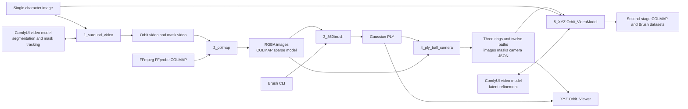
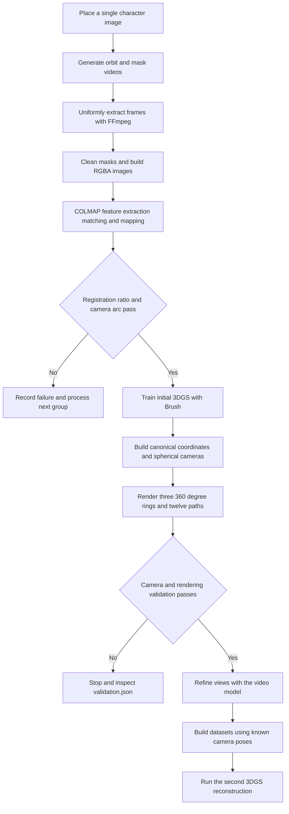
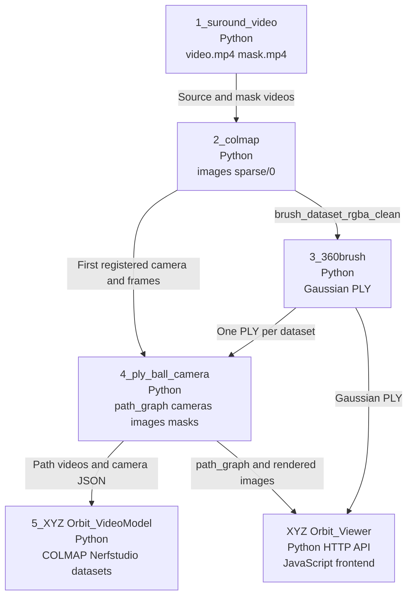

# VideoSplat

<p align="right">
  <a href="./README.md"></a>
  <a href="./README_EN.md"></a>
</p>

## Project Overview

VideoSplat is a Python-first research toolchain that turns a single character image into a 3D Gaussian Splatting (3DGS) character. It uses a video model to generate an orbiting character video, cleans and segments its frames, estimates camera poses with COLMAP, and trains an initial 3DGS representation with Brush. The initial model is then rendered along fixed horizontal, vertical, and diagonal camera paths for a second refinement and reconstruction stage.

The project addresses a specific problem: converting cross-view frames from generated video into verifiable reconstruction data with traceable camera poses. It is intended for engineers and researchers working on single-image 3D reconstruction, multi-view generation, 3DGS, Gaussian-to-Mesh conversion, and character animation. The repository contains five Python processing stages, ComfyUI workflows, and a local viewer.

The following example uses character 2 from the original project. The GIF files play directly on GitHub, and full MP4 versions are linked below.

<table>
  <tr>
    <th>Source character image</th>
    <th>Generated orbit video</th>
    <th>3DGS model render</th>
  </tr>
  <tr>
    <td></td>
    <td></td>
    <td></td>
  </tr>
</table>

- [View the full orbit video MP4](docs/assets/demo/character-2-orbit.mp4)
- [View the full 3DGS model render MP4](docs/assets/demo/character-2-3d.mp4)

## Architecture Overview

All five processing stages use Python as their entry point and orchestration layer. Stage 1 creates an orbit video and mask from a source image. Stage 2 extracts frames, cleans RGBA images, runs COLMAP, and validates the reconstruction. Stage 3 invokes the Brush CLI to train the initial Gaussian PLY. Stage 4 keeps the Gaussian model fixed, derives a canonical coordinate system from the first registered camera, and renders six anchors, three complete rings, and twelve camera paths. Stage 5 sends path videos, the reference image, and camera JSON data through a video-model refinement workflow, then exports COLMAP and Brush datasets with known poses.

The stages exchange files rather than communicating through a shared service. Their primary data contracts are MP4 videos, RGBA PNG images, COLMAP text models, Gaussian PLY files, per-frame camera JSON, `path_graph.json`, and Nerfstudio `transforms.json`.



## System Flow

Stage 2 requires a minimum registered-image ratio of 80%, a camera arc of at least 300 degrees, and a bounded camera step. A failed group is recorded while batch processing continues with the next group. Stage 4 validates the fixed radius, path angles, shared anchors, camera intrinsics, Front reprojection, mask format, and video dimensions. A failed validation stops that dataset. Stage 5 can resume from generated videos or skip generation and only prepare datasets.



The module-level data relationships are shown below.



## Folder Structure

```text
VideoSplat/
├── README.md
├── README_EN.md
├── docs/assets/demo/
│   ├── character-2-source.webp
│   ├── character-2-orbit.gif
│   ├── character-2-orbit.mp4
│   ├── character-2-3d.gif
│   └── character-2-3d.mp4
├── 1_suround_video/
│   ├── main.py
│   ├── config.py
│   └── VideoSplat_360.json
├── 2_colmap/
│   ├── main.py
│   ├── core.py
│   ├── nodes.py
│   └── requirements.txt
├── 3_360brush/
│   ├── main.py
│   └── config.py
├── 4_ply_ball_camera/
│   ├── run.py
│   ├── config.json
│   ├── scripts/
│   └── src/
├── 5_XYZ Orbit_VideoModel/
│   ├── main.py
│   ├── config.json
│   ├── workflows/
│   └── tests/
├── XYZ Orbit_Viewer/
│   ├── app.py
│   ├── config.json
│   ├── frontend/
│   └── tests/
└── test/
    ├── 5latitude/
    └── VGGSfM/
```

The numbered stage folders remain at the repository root, matching the original project design. Each stage has its own Python entry point and reads from or writes to local `input/` and `output/` directories. Runtime datasets, model weights, PLY files, and ordinary video outputs are ignored by Git. Only the compressed README demonstrations are versioned.

## Key Modules and Files

| File | Responsibility | Relationship |
|---|---|---|
| `1_suround_video/main.py` | Uploads images, creates a ComfyUI prompt, waits for results, and downloads the main and mask videos | Reads `config.py` |
| `2_colmap/core.py` | Extracts frames, cleans masks, defringes RGB, runs COLMAP, and validates datasets | Shared by the CLI and ComfyUI nodes |
| `2_colmap/nodes.py` | Registers the Build Dataset and Preview Dataset nodes | Calls `core.run_pipeline` |
| `3_360brush/main.py` | Validates RGBA/COLMAP data and invokes the Brush CLI | Reads `config.py` |
| `4_ply_ball_camera/src/pipeline.py` | Coordinates PLY loading, canonical coordinates, rings, paths, videos, and validation | Uses the camera, render, Gaussian, and export modules |
| `4_ply_ball_camera/src/camera.py` | Builds the canonical basis, great-circle paths, and continuous ring cameras | Produces per-frame camera metadata |
| `4_ply_ball_camera/src/render.py` | Renders RGB and background-key masks with gsplat/CUDA | Reads Gaussian data and camera JSON |
| `5_XYZ Orbit_VideoModel/main.py` | Schedules refinement, extracts frames, matches cameras, and builds COLMAP and Brush datasets | Reads `config.json` and the API workflow |
| `XYZ Orbit_Viewer/app.py` | Indexes path data and serves the local HTTP API and static files | Serves the built frontend |

## Installation and Requirements

1. Install Python 3.9 or newer. The original files do not define the exact tested Python patch version.
2. Install FFmpeg and FFprobe and add them to `PATH`.
3. Install a CUDA-enabled COLMAP build and add it to `PATH`, or set `VIDEOSPLAT_COLMAP`. Install Stage 2 packages with `python -m pip install -r 2_colmap/requirements.txt`.
4. Prepare a Brush CLI build that supports the required flags, add it to `PATH`, or set `VIDEOSPLAT_BRUSH_EXE`.
5. Install Stage 4 packages with `python -m pip install -r 4_ply_ball_camera/requirements.txt`, and prepare a CUDA compiler and Visual Studio 2022 C++ Build Tools.

Additional Stage 1 Python packages are listed in `1_suround_video/requirements.txt`. Stages 1 and 5 require a running ComfyUI instance, the corresponding video-model workflows, and their custom nodes. Exact ComfyUI, custom-node, and model versions are not defined.

The Viewer backend uses only the Python standard library. Frontend packages are locked in `XYZ Orbit_Viewer/package-lock.json`; run `npm ci` and `npm run build`. The minimum Node.js version is not defined.

## How to Use

Run the following commands from the repository root. Every stage retains its own `input/` and `output/` directories.

1. Put character images in `1_suround_video/input/`, start ComfyUI, and run `python 1_suround_video/main.py`.
2. Put each main video and its filename-containing-`mask` companion in `2_colmap/input/<group>/`, then run `python 2_colmap/main.py`.
3. Put the previous dataset in `3_360brush/input/<group>/brush_dataset_rgba_clean/`, then run `python 3_360brush/main.py`.
4. Put a PLY, its COLMAP text model, and registered images in `4_ply_ball_camera/input/` or `input/<group>/`, then run `python 4_ply_ball_camera/run.py`.
5. Put the Stage 4 path videos and camera paths in the expected locations under `5_XYZ Orbit_VideoModel/input/`. Run `python "5_XYZ Orbit_VideoModel/main.py" --check`, followed by `python "5_XYZ Orbit_VideoModel/main.py"`.

To use the Viewer, place the Stage 4 `path_graph.json`, `anchors/`, `paths/`, and PLY under `XYZ Orbit_Viewer/input/`. Run `npm ci` and `npm run build` in the Viewer folder, then run `python "XYZ Orbit_Viewer/app.py"` from the repository root. The default URL is `http://127.0.0.1:8000/`.

## Configuration

| Location | Settings | Effect |
|---|---|---|
| `1_suround_video/config.py` | ComfyUI URL, workflow model files, seed, dimensions, duration, masks, and prompt | Controls initial orbit and mask generation |
| `2_colmap/core.py` `PipelineConfig` | Maximum frames, mask threshold, erosion, defringe, registration ratio, and camera arc | Controls image cleanup and COLMAP validation |
| `VIDEOSPLAT_COLMAP` or `--colmap` | COLMAP executable or installation directory | Overrides PATH discovery |
| `3_360brush/config.py` | Brush steps, splat limit, resolution, SH, alpha, growth, and batch policy | Controls initial 3DGS training |
| `VIDEOSPLAT_BRUSH_EXE` | Brush CLI path | Overrides PATH discovery |
| `4_ply_ball_camera/config.json` | Frame interval, rendering, masks, PLY scale, near/far planes, and tolerances | Controls fixed cameras and gsplat rendering |
| `5_XYZ Orbit_VideoModel/config.json` | ComfyUI URL, input paths, workflow, frame counts, seed, timeout, and node IDs | Controls second-stage generation and dataset output |
| `XYZ Orbit_Viewer/config.json` | Drag sensitivity, camera points, paths, model scale, axes, and view distance | Controls Viewer presentation |

The project does not require a `.env` file and contains no confirmed cloud API token. Stages 1 and 5 use the configured ComfyUI HTTP URL.

## Developer Guide

1. Read the five numbered stages in order, starting with each `main.py` or `run.py`, followed by its configuration file.
2. To trace data formats, read `2_colmap/core.py`, `4_ply_ball_camera/src/source_camera.py`, `camera.py`, `pipeline.py`, and `5_XYZ Orbit_VideoModel/main.py`.
3. When changing camera conventions, verify the COLMAP/OpenCV and Nerfstudio/OpenGL conversions together with W2C/C2W JSON fields.
4. After changing Stage 4 rendering or mask logic, run `4_ply_ball_camera/scripts/validate_project.py` and inspect `validation.json`.
5. When changing Stage 5 workflow node IDs, update `config.json.workflow_nodes`. After Viewer changes, run both frontend and Python tests.

New processing stages should preserve the existing file contracts and emit traceable metadata. Changes to camera JSON, `path_graph.json`, or `transforms.json` must be coordinated with all downstream readers.

## Limitations and TODO

- A license has not been defined. Third parties cannot determine reuse rights until a LICENSE file is added.
- End-to-end automated testing has not been defined. Existing tests cover part of the Stage 5 camera conversion and the Viewer data index, HTTP server, and path orientation.
- Stage 3 depends on a Brush CLI build with specific flags; a compatible version and build process are not defined.
- The Stage 4 launcher is currently Windows-specific, searches for Visual Studio 2022, and defaults `TORCH_CUDA_ARCH_LIST` to `12.0`.
- Stage 5 writes an empty COLMAP `points3D.txt` because it reuses known camera poses and does not create fictional 3D feature points.

No explicit `TODO`, `FIXME`, or `XXX` markers were found in the code. The items above are derived from the implemented entry points, configuration, validation logic, and test scope.

## Notes

The research plan frames this pipeline as generated multi-view video combined with conventional 3D reconstruction. Planned comparisons with direct Image-to-3D approaches include multi-view consistency, geometric accuracy, appearance preservation, reconstruction quality, computational cost, and editability. Comparative experiments, Gaussian-to-Mesh conversion, rigging, and character animation validation are not implemented in the main repository pipeline.

The original research document, other character images, model weights, full PLY files, COLMAP databases, Brush training outputs, and large experiment artifacts are not included. The character 2 assets in this README are resized and compressed copies for GitHub viewing; they are not training inputs or complete model files.
